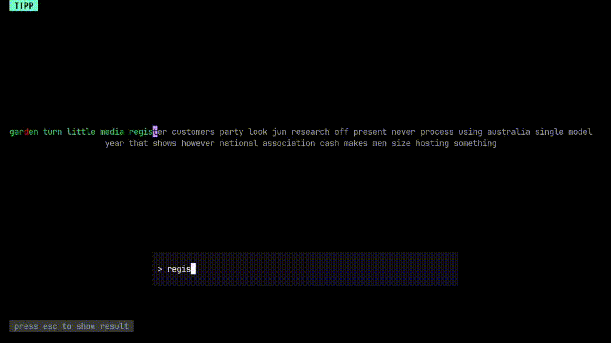

# tipp

tipp is a terminal typing test made with Golang and BubbleTea, inspired by ttyper.



## Installation
### Direct using curl 

```bash
curl -fsSL https://raw.githubusercontent.com/biisal/tipp/refs/heads/main/install.sh | bash
```

### Using go
```bash
go install github.com/biisal/tipp@latest
```
- Add Go bin folder to your PATH
```bash
# temporary
export PATH=$PATH:$(go env GOPATH)/bin
# for permanent add to ~/.bashrc or ~/.zshrc (or whatever your shell is)
echo 'export PATH=$PATH:$(go env GOPATH)/bin' >> ~/.bashrc
```
--- 


## Building from source
- Clone the repository
```bash
git clone https://github.com/biisal/tipp.git
```

- Build the binary
```bash
cd tipp
go build  -o tipp .
```

- Run the binary
```bash
./tipp
```
If you are using Linux or macOS, you can put the binary in your /usr/local/bin directory (or any directory listed in your $PATH) to run it as a command from anywhere.

Example:
```bash
sudo cp tipp /usr/local/bin
```
Now you can run:
```bash
tipp
```
### Usage

- Add your words to the `words.txt` file in:
>
> * **Linux/macOS:** `$HOME/.config/tipp/words.txt`
> * **Windows:** `%APPDATA%\tipp\words.txt`

---

### **Steps to edit/create it**

**Linux/macOS:**

```bash
mkdir -p $HOME/.config/tipp
nano $HOME/.config/tipp/words.txt
```

**Windows (PowerShell):**

```powershell
New-Item -ItemType Directory -Force "$env:APPDATA\tipp"
notepad "$env:APPDATA\tipp\words.txt"
```

* Add your words 
* Save the file, and your program will use them automatically.

---
- For help run `tipp -h` : 
```bash
Usage of tipp:
  -w int
        Number of words to type. Max is 600 (default 30)
```
Thanks !
